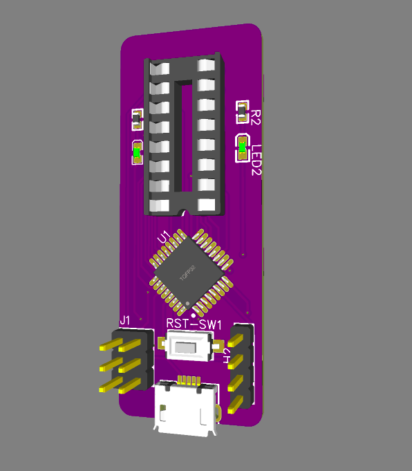

# 41x-dram-tester  

A hardware tester for old 4116, 4164 &amp; 41256 DRAM modules  

This is just a simple PCB I designed to unify the open-sourced, arduino-based [4116](https://labs.frostbox.net/2020/03/24/4116-d-ram-tester-with-schematics-and-code/) and [4164/41256](https://forum.defence-force.org/viewtopic.php?t=1699) DRAM testers into one piece of hardware. It is not too different to the 2 arduino projects, so their code **might** work with this PCB. I started writing some code based on their examples, but I haven't been able to confirm it as functional (and it's practically the same as the original pieces of code, just made to fit the different PCB layout), hence I haven't put it here.  

## THIS IS STILL WORK IN PROGRESS. IT MAY NOT FUNCTION AS INTENDED. I DON'T HAVE A NEED TO CONTINUE DEVELOPING IT AND I HAVE OTHER, MORE IMPORTANT PROJECTS. THIS MIGHT NEVER BE FINISHED. FEEL FREE TO FORK AND DO WITH IT AS YOU WISH. THIS WAS MY FIRST PROJECT IN DEVELOPING HARDWARE, BUGS ARE TO BE EXPECTED.  
